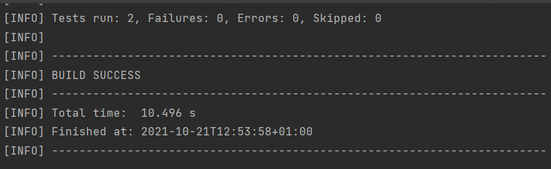
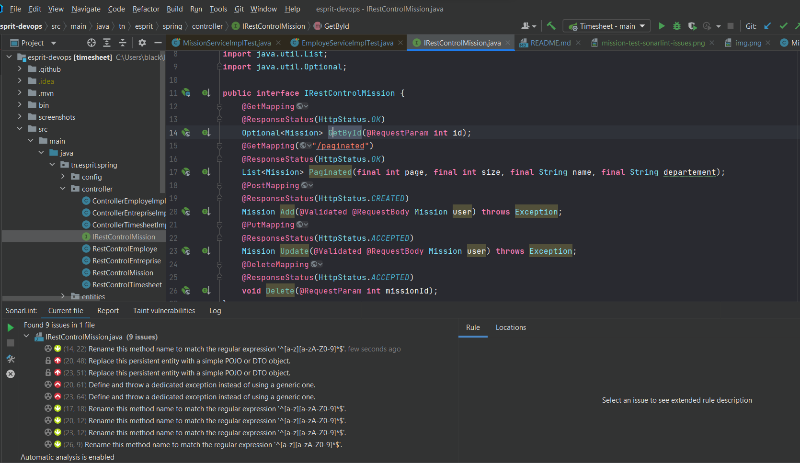
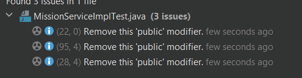
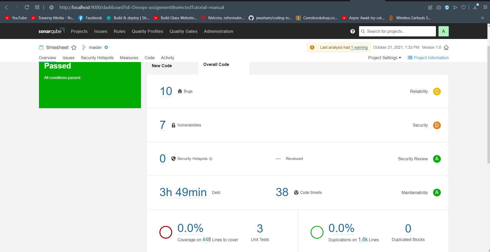
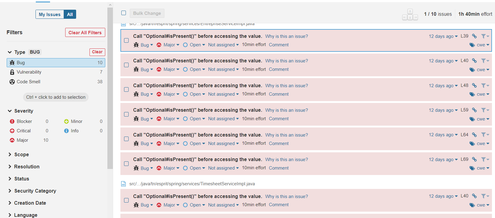
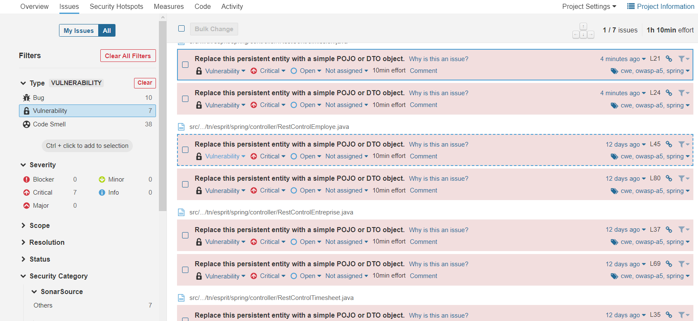
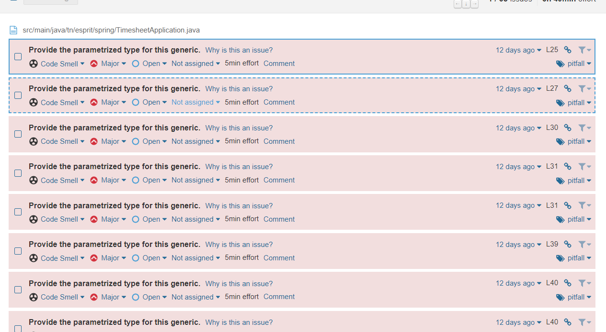

*** TEST
Tests fail on github actions because it fails to load local DB context, but tests pass on dev 

SonarLint Issues 
Controllers :

Tests :

Sonar cube command : 
mvn clean verify sonar:sonar \
-Dsonar.projectKey=Devops-assignment \
-Dsonar.host.url=http://localhost:9000 \
-Dsonar.login=691ea91b53a1805f07ba43958891da78cf9baec1

Sonar cube analysis : 

Bugs :

Vulnerabilities :

Code smells :

Nexus deploy :
mvn clean package deploy:deploy-file -DgroupId=tn.esprit.spring e -DartifactId=timesheet1 -Dversion=1.0 -DgeneratePom=true -Dpackaging=jar -DrepositoryId=deploymentRepo -Durl=http://localhost:8081/repository/maven-releases/ -Dfile=target/timesheet-1.0jar
